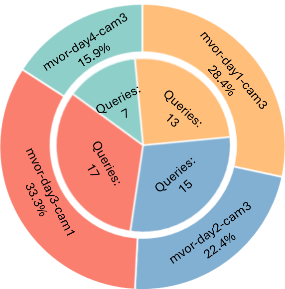

## TCVideoRSBenchmark

This dataset is designed for the Temporally-Constrained Video Reasoning Segmentation (TCVideoRS) task in Operating Room setting. Note that this dataset is constructed based on the existing video object identification datasets [MVOR](https://github.com/CAMMA-public/MVOR) (released under CC BY-NC-SA 4.0 License). By downloading, using, or sharing this dataset, you will agree to comply with the license. 

### Download
You can first clone the repository:
```
git clone https://github.com/arcadelab/TCVideoRSBenchmark.git
```
Then unzip ``mask.zip`` to the same path with the data file ``data.json``.

Original video is available [here](https://drive.google.com/drive/folders/1BxSNbxIduUUeXVFbZo_p4Lv4tsWk8gTV?usp=drive_link).

### Dataset Description
The data file ``data.json`` contains 52 data, each containing a query and a path of ground truth masks for 4 videos. For more information on the videos, please step to [MVOR](https://github.com/CAMMA-public/MVOR).

 <p align="center">  </p>

### Statistics
 <p align="center"></p>

### License
The data of TCVideoRSBenchmark is released for non-commercial research purpose only.
